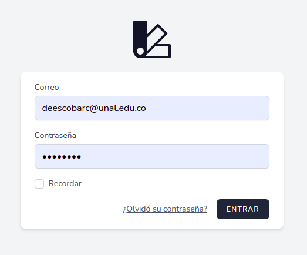
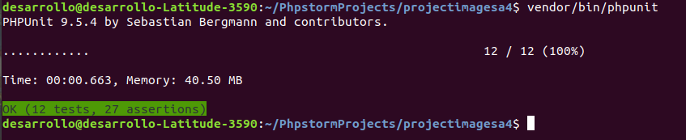
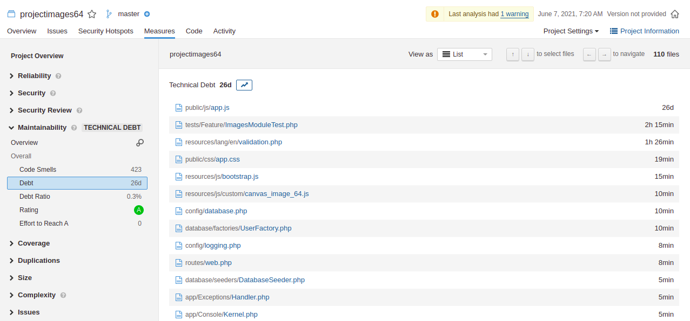
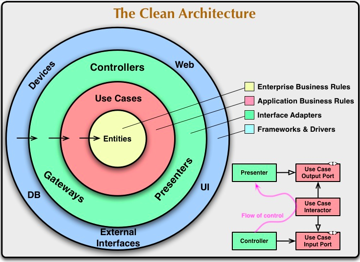
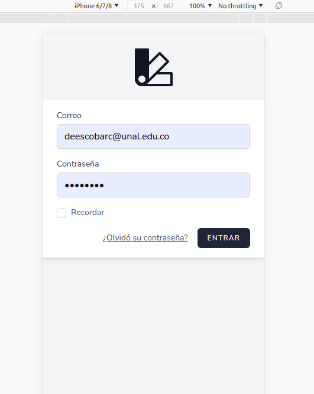
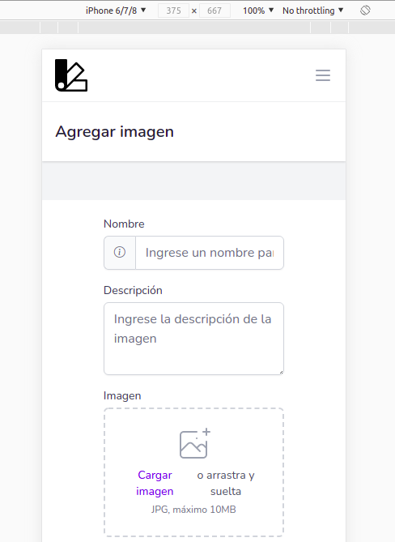
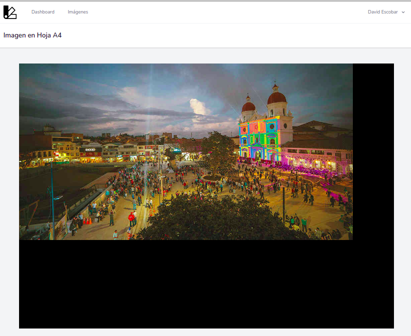

## Prueba técnica imágenes en hojas A4

Aplicación desarrollada para prueba técnica de la compañía Protección, para el cargo Líder técnico de desarrollo.

### Funcionamiento

La aplicación es una biblioteca de imágenes, donde cada usuario se puede registrar y cargar imágenes en formato JPG de cualquier dimensión (Ancho por alto), para luego ser visualizadas en una hoja tamaño A4, con las siguientes características

* La imagen no pierde su relación de aspecto ancho por alto
* Se aprovecha el máximo de la hoja A4
* Ninguna imagen es agrandada en el proceso, solo encogida cuando sus dimensiones son mayores a la medida A4
* La orientación de la página se define a partir de la orientación de la imagen

### Aspectos no funcionales

* Rendimiento y optimización de recursos

Se creó una aplicación web con una base de datos relacional, donde se guarda el nombre, la descripción, ruta de guardado, fecha de creación, modificación y eliminación de la imagen que se cargue.
El archivo de la imagen se guarda en disco, y en caso de que sean miles de imágenes se dejó abierta la posibilidad de indicar en donde serán guardadas las imágenes, como por ejemplo un servicio en la nube de almacenamiento. 

* Seguridad

Se implementó un login y registro de usuarios en la aplicación, además también se tiene la posibilidad de una autenticación por API utilizando OAuth2.

* Cobertura de pruebas unitarias

La metodología de diseño de software se basó en TDD (Desarrollo dirigido por pruebas) que es una práctica de programación que consiste en escribir primero las pruebas (generalmente unitarias), después escribir el código fuente que pase la prueba satisfactoriamente y, por último, refactorizar el código escrito.
Las pruebas fueron desarrolladas con php unit que es un framework de pruebas orientado a programadores en PHP.
Se hicieron pruebas a las funcionalidades del CRUD (Crear, leer, actualizar y borrar) además a la carga de la imagen. 

* Índice de deuda técnica

Para el cálculo de la deuda técnica se utilizó la metodología SQALE (Software Quality Assessment based on Lifecycle Expectations) que es una evaluación de la calidad del software basada en las expectativas del ciclo de vida.
Esta metodología se basa en bloques duplicados de código, las pruebas unitarias falladas, ramas cubiertas por las pruebas unitarias insuficientes, densidad de comentarios insuficientes, cobertura de líneas cubierta por pruebas unitarias insuficientes y pruebas unitarias omitidas. 
Para esta implementación se utilizó el software SonarQube que tiene miles de reglas de análisis de código estático automatizadas que protegen la aplicación en múltiples frentes y además sirve de guía en el desarrollo.

Al ejecutar la herramienta en el código se observó que hay una deuda técnica de 26 días, pero al revisar el motivo, se observó que el problema está en un archivo de javascript llamado app.js el cual es un compilado de todo el javascript utilizado en la aplicación, lo que hace que más liviana la carga de la página, al omitir este archivo en la revisión se obtuvo una deuda técnica de 5 horas y 23 minutos.

* Código limpio + Clean Architecture

Para clean code se basó el código en los principios de ingeniería de software, del libro [Clean Code](https://www.amazon.com/Clean-Code-Handbook-Software-Craftsmanship/dp/0132350882 "Clean Code") de Robert C. Martin y la [adaptación en PHP](https://github.com/jupeter/clean-code-php "adaptación en PHP") para producir software legible, reutilizable y refactorizable.

Para clean architecture se realizó una implementación por capas, basada en entidades encapasulando las reglas de negocio, casos de uso para el flujo de datos, adaptadores de interfaz para dar formato a los datos, frameworks, controladores y la regla primordial de clean architecture que se basa en la inyección de dependencias para que las dependencias del código apunten hacia adentro de las capas.

Esta arquitectura permite que la solución se puede integrar fácilmente a un software más grande, además se dejó abierta la posibilidad de implementar una API y así realizar una integración adecuada. Para el mantenimiento de esta solución al estar basada en capas, solamente se necesita tener clara la arquitectura para agregar o modificar lo que se necesite. 

* Stack usado

**Lenguaje de programación backend:** PHP es un lenguaje de código abierto muy popular especialmente adecuado para el desarrollo web y que puede ser incrustado en HTML.

**Framework Web:** Laravel es un framework expresivo, con sintaxis elegante, es flexible y adaptable no solo al MVC tradicional, sino a arquitecturas limpias, además tiene una documentación muy completa y fácil de entender.

**Base de datos:** PostgreSQL se eligió por ser un potente sistema de base de datos relacional, es de código abierto con más de 30 años de desarrollo activo, con los que ha ganado una sólida reputación por su fiabilidad, solidez de funciones y rendimiento.

**Lenguaje frontend:** para el front se trabajó directamente con HTML, CSS y JavaScript, que es lo más usual en una aplicación web.

**Framework CSS:** Tailwind es un framework que implementa flexbox, lo que ayuda a que la aplicación sea responsive, además tiene muchas clases de utilidad para construir cualquier diseño de interfaces web.

**Instalador de dependencias:** NPM es el repositorio más grande de librerías para javascript que existe, además a través de NPM se configuró laravel mix, que permite que todo el javascript y css de la aplicación se encapsule en solo dos archivos y así tener una carga muy rápida de la página. 

**Librería para la manipulación de imágenes:** Canvas es una API nativa de javascript que se puede usar para dibujar todo tipo de gráficos, como composiciones fotográficas, crear animaciones, o incluso procesado o renderizado de vídeo en tiempo real.

* Estrategia de despliegue - nube, onpremise, standalone
  
La aplicación se probó realizando un despliegue a nivel local en un sistema operativo linux ubuntu, a través de un servidor web apache, que es de código abierto, seguro, eficiente y extensible, lo que proporciona servicios HTTP en sincronía con los estándares HTTP actuales. Sin embargo se puede realizar un despliegue en los servicios actuales en la nube, como AWS y Azure, dado que el stack utilizado es completamente compatible. 

* Responsive

Se desarrolló una aplicación responsive, para cualquier tamaño de pantalla.

* Analizador de código estático

Se instaló el analizador de código llamado SonarQube basado en reglas y evidencias que se enfocan en:

* Los bloques duplicados
* Las pruebas unitarias falladas
* Ramas cubiertas por las pruebas unitarias insuficientes
* Densidad de comentarios insuficientes
* Cobertura de líneas cubierta por pruebas unitarias insuficientes
* Pruebas unitarias omitidas

### Aspectos funcionales

La aplicación consiste en crear un usuario, hacer login, ingresar al menú de Imágenes, donde se pueden crear, ver, editar y eliminar imágenes. Cada imagen se puede ver un formato A4 con las características definidas en la prueba técnica.

### Información del desarrollador

**David Esteban Escobar Castro**

Desarrollador fullstack con excelentes habilidades en lenguajes de programación como Python, PHP, Java y JavaScript, además de sistemas de gestión de bases de datos (PostgreSQL, Oracle, MySQL y MongoDB), con experiencia en metodologías ágiles como SCRUM así como integración continua.

